<div align="center">
  

  # 🛡️ VeriHealth

  **Proving health facts with absolute cryptographic certainty. Sharing zero medical data.**

  
  
  
  
  

  [](https://github.com/thisisouvik/VeriHealth/actions/workflows/typecheck.yml)
  [](https://github.com/thisisouvik/VeriHealth/actions/workflows/test.yml)
  [](https://github.com/thisisouvik/VeriHealth/actions/workflows/build.yml)
  
  > ⚠️ **DISCLAIMER: This application is live and running entirely on the Midnight PREPROD Network.**
</div>

---

## 🔗 Important Links

* **Live Preprod Demo:** [https://verihealth-preprod.vercel.app](https://verihealth-preprod.vercel.app) *(Live VeriHealth Application on Preprod)*
* **GitHub Repository:** [https://github.com/thisisouvik/VeriHealth](https://github.com/thisisouvik/VeriHealth)
* **Product X (Twitter):** [https://x.com/verihealth_web3](https://x.com/verihealth_web3) *(Official VeriHealth X Profile)*
* **Demo Video:** [Watch the VeriHealth MVP Demo](https://youtu.be/iOvpBq-Rhko)

---

## 📖 Table of Contents
1. [About the Product](#-about-the-product)
2. [Public State vs Private Witness](#-public-state-vs-private-witness-midnight-zk)
3. [Project Screenshots](#-project-screenshots)
4. [Smart Contracts](#-smart-contracts)
5. [System Architecture](#-system-architecture)
6. [User Workflow](#-user-workflow)
7. [File Structure](#-file-structure)
8. [Testing](#-testing)
9. [Future Implementation](#-future-implementation--real-world-applications)

---

## 💡 About the Product

### The Problem
Healthcare data sharing today is all-or-nothing. Proving a single fact — vaccination status, procedure eligibility, allergy-free status — typically requires handing over an entire medical record or portal login. Every recipient of that data becomes a new breach target and a new compliance liability, even though regulations like HIPAA and GDPR explicitly call for data minimization. Current tooling forces a trade-off between usability and privacy that the law does not actually require.

### The Solution
**VeriHealth** is a zero-knowledge health credential network built entirely on the **Midnight Blockchain**. 
Hospitals and labs issue medical facts as cryptographically signed credentials that never leave the patient's device. To prove something to an employer, insurer, or pharmacy, the patient's wallet generates a Zero-Knowledge proof — mathematical evidence the fact is true — without revealing why. 

Verifiers check the proof on-chain in milliseconds and learn only the answer (e.g., `VALID: YES`), never the medical record.

---

## 🔐 Public State vs Private Witness (Midnight ZK)

VeriHealth leverages Midnight's native Data Protection features to separate what is public from what is private:

- **Public State:** The registry of authorized issuers (Hospitals/Labs) and the cryptographic commitments of the credentials. This ensures anyone can verify *who* issued a credential and that it hasn't been revoked, ensuring trust without central authorities.
- **Private Witness:** The actual clinical data (blood pressure, specific test results, PII). This data stays purely on the Patient's device. During verification, the ZK Circuit acts as a private witness, asserting that the patient holds a valid credential matching the public commitment, without ever leaking the payload to the network.

---

## 📸 Project Screenshots

<div align="center">
  <p><b>Landing Page</b></p>
  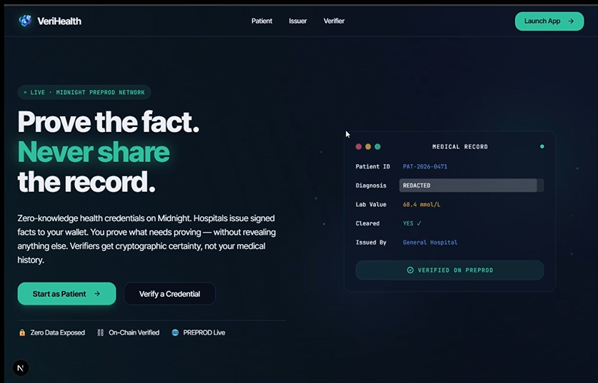
  
  <p><b>Admin Panel (Registering Issuers)</b></p>
  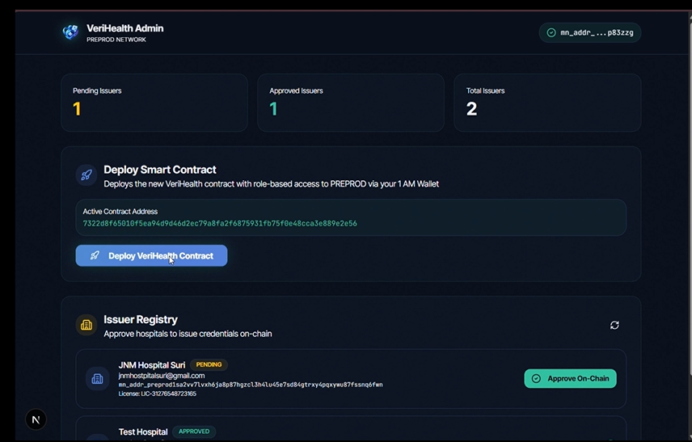

  <p><b>Issuer Portal (Form & Issuing)</b></p>
  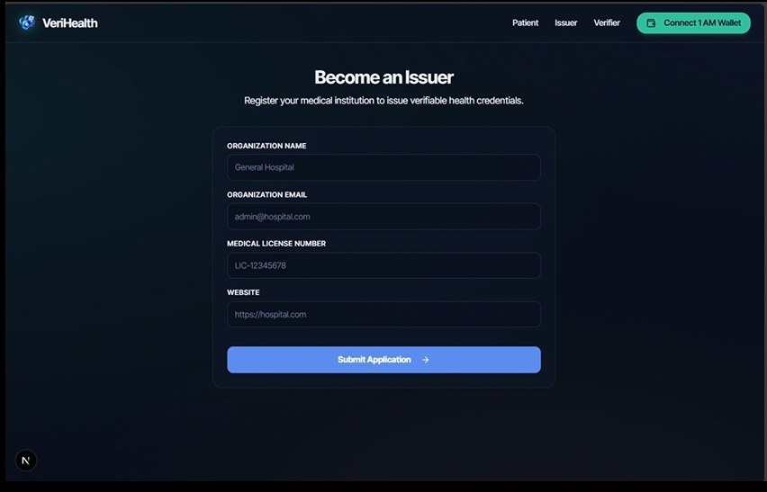
  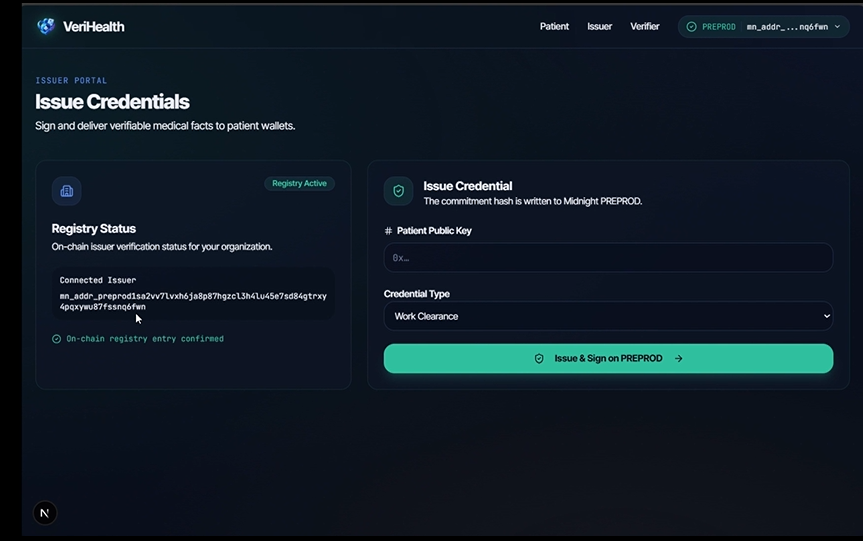

  <p><b>Patient Dashboard</b></p>
  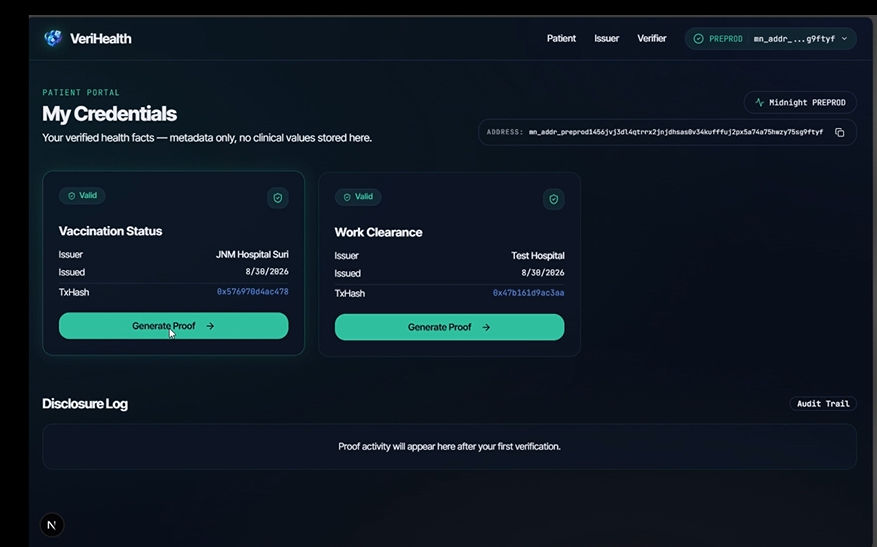

  <p><b>Verifier Portal (Challenge & Results)</b></p>
  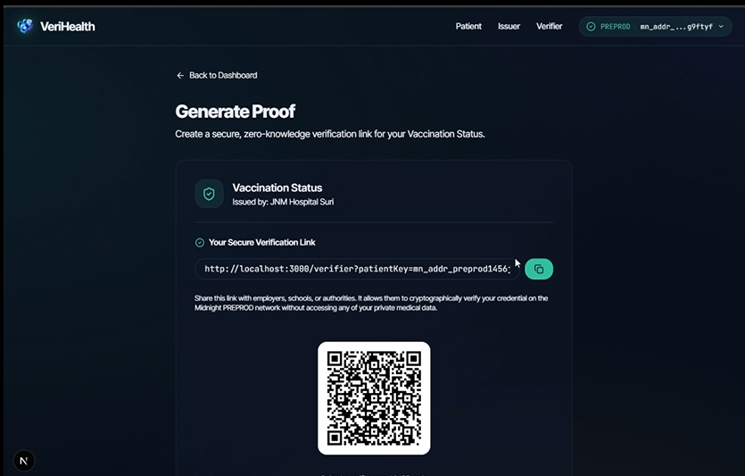
  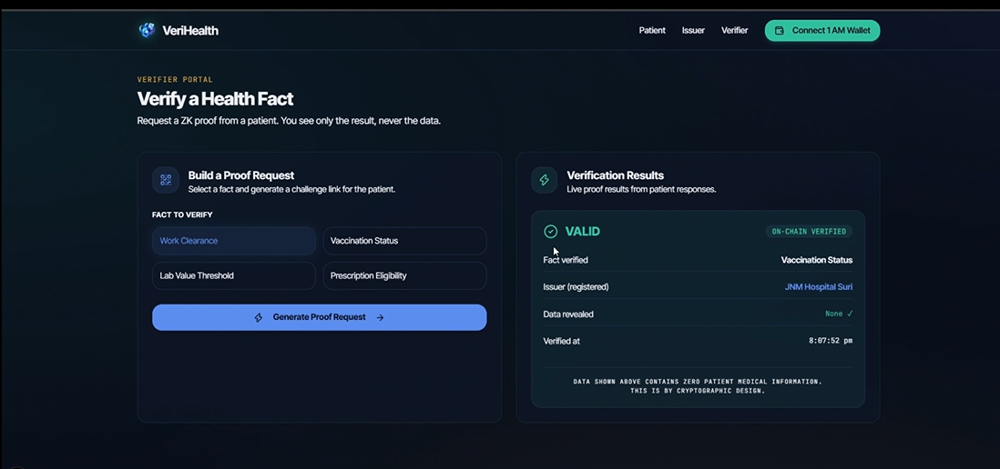
</div>

---

## 📜 Smart Contracts

Our smart contracts are written in **Compact** and deployed on the **Midnight PREPROD** network. They handle institutional trust through authorized registries and credential revocation.

### On-Chain Proof Links (1 AM Explorer)
- 🚀 **Contract Deployment:** [ed874663b370bed01e95d9b33412caaaaa19066a509c9e8e15755406d1d75543](https://explorer.1am.xyz/tx/ed874663b370bed01e95d9b33412caaaaa19066a509c9e8e15755406d1d75543?network=preprod)
- 🏥 **Register Issuer Tx:** [1579645f5e6c7ad2f33a009300870386636574ef9ea16e289a0687addd7afec5](https://explorer.1am.xyz/tx/1579645f5e6c7ad2f33a009300870386636574ef9ea16e289a0687addd7afec5?network=preprod)
- 📄 **Issue Credentials Tx:** [3030488a6b33e15b2fbc5ee1dd6b88ed3b65b6b2377a721ccab4de5c9d315fd2](https://explorer.1am.xyz/tx/3030488a6b33e15b2fbc5ee1dd6b88ed3b65b6b2377a721ccab4de5c9d315fd2?network=preprod)

### Contract Execution Screenshots

<div align="center">
  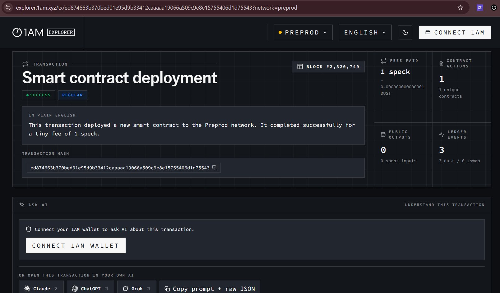
  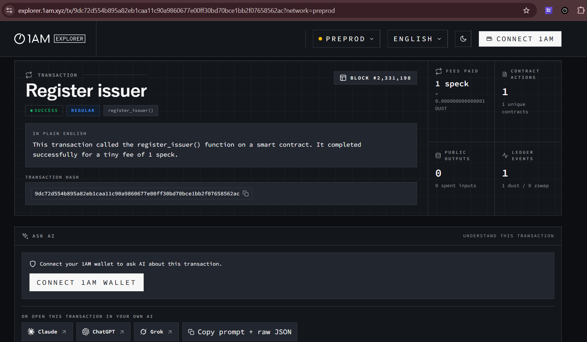
  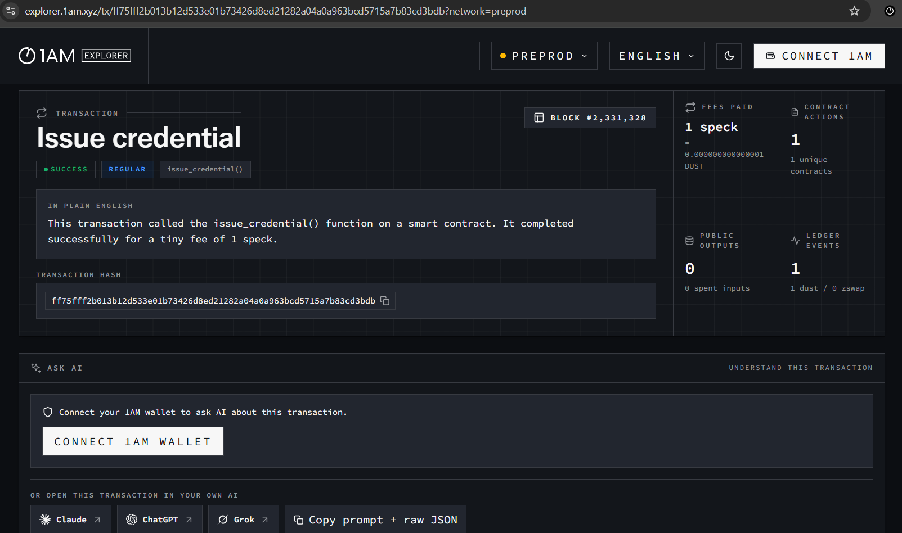
</div>

---

## 🏗️ System Architecture

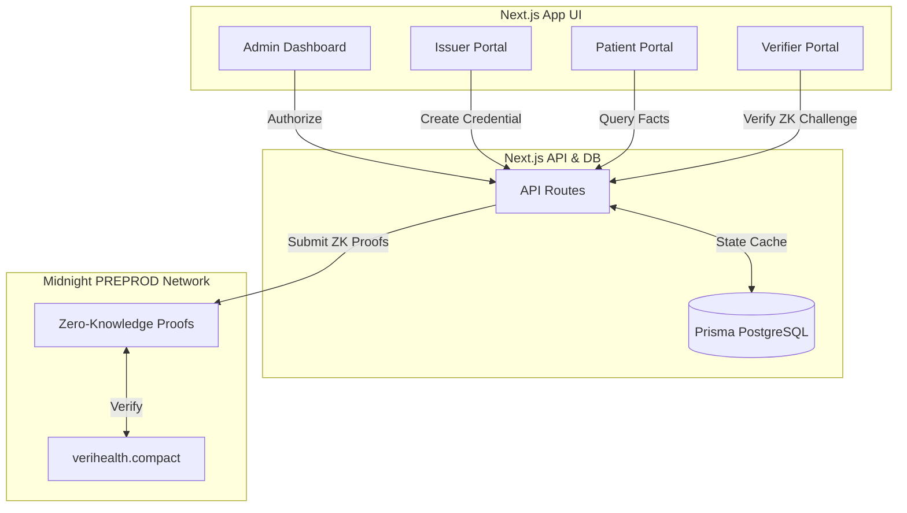

---

## 🔄 User Workflow

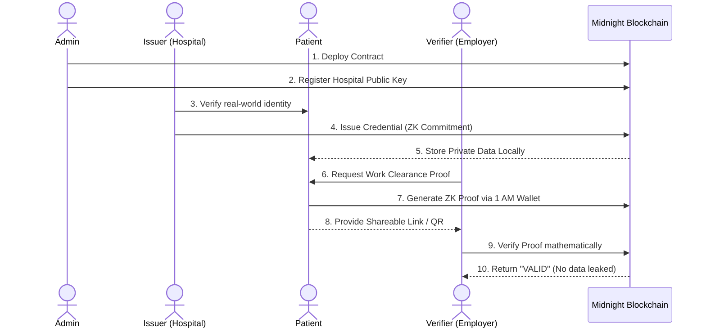

---

## 📁 File Structure

```text
VeriHealth/
├── app/                  # Next.js App Router (Frontend + API)
│   ├── (auth)/           # Dashboards (Admin, Issuer, Patient, Verifier)
│   ├── api/              # Backend routes interfacing with Midnight SDK
│   └── components/       # Reusable UI components
├── contracts/            # Midnight Smart Contracts
│   ├── src/
│   │   └── verihealth.compact  # Core ZK Circuit Logic
│   └── artifacts/        # Compiled circuits and prover keys (.bzkir)
├── prisma/               # Database schema and migrations
├── __tests__/            # Jest UI test suite
├── .github/workflows/    # CI/CD Pipelines
└── assets/               # Documentation images & screenshots
```

---

## 🧪 Testing

We use **Jest** and **React Testing Library** to ensure UI reliability, combined with strict TypeScript checks via our GitHub Actions CI pipeline.

To run tests locally:
```bash
npm install
npm run test
```

<div align="center">
  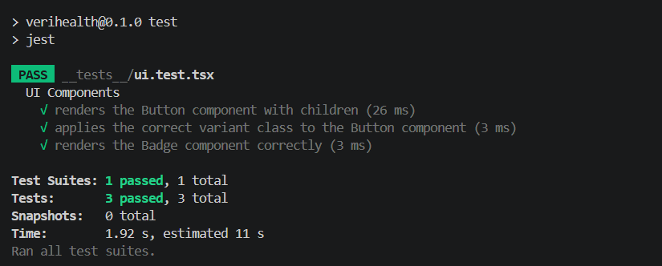
</div>

---

## 🚀 Future Implementation & Real World Applications

VeriHealth’s architecture paves the way for a massive transformation in health data handling:

1. **IoT Medical Devices:** Wearables (like glucose monitors or ECG patches) could act as direct issuers to a patient's Midnight wallet. A patient could prove to an insurance company that they maintained healthy thresholds all year *without* revealing their exact minute-by-minute biometric data.
2. **Pharmacy Prescriptions:** A doctor issues a prescription credential. The patient proves to a pharmacy that they hold a valid script for a specific medication without the pharmacy system having access to their broader medical diagnosis or history.
3. **Automated Insurance Underwriting:** Submitting ZK proofs of health factors to immediately fulfill smart-contract-based insurance policies, bypassing manual claims review and completely eliminating data leaks.

---

## 🎉 Salutation

A massive **Thank You** to the Midnight Team for organizing this incredible hackathon, providing phenomenal documentation, and building a blockchain that genuinely prioritizes data protection and privacy! 🌑✨
