<div align="center">
  

  # 🏥 VeriHealth

  **Proving health facts with absolute cryptographic certainty. Sharing zero medical data.**

  
  
  
  
  

  [](https://github.com/thisisouvik/VeriHealth/actions/workflows/ci.yml)
  [](https://github.com/thisisouvik/VeriHealth/actions/workflows/contracts.yml)
  [](https://github.com/thisisouvik/VeriHealth/actions/workflows/typecheck.yml)
  [](https://github.com/thisisouvik/VeriHealth/actions/workflows/test.yml)
  [](https://github.com/thisisouvik/VeriHealth/actions/workflows/build.yml)

  > ⚠️ **DISCLAIMER: This application is live and running entirely on the Midnight PREPROD Network.**
</div>

---

## 🔗 Important Links

| | Link |
|---|---|
| 🌐 **Live Demo** | [verihealth-preprod.vercel.app](https://verihealth-preprod.vercel.app) |
| 📊 **Product Slide Deck** | [VeriHealth Pitch Deck](https://docs.google.com/presentation/d/1oRfNSnjhIXojgAsoWdB_XjCENBlJ2nrGNVABVuULjYE/edit?usp=sharing) |
| 🐦 **Official X / Twitter** | [@verihealth_web3](https://x.com/verihealth_web3) |
| 🎬 **Demo Video** | [Watch VeriHealth MVP Demo](https://youtu.be/iOvpBq-Rhko) |

---

## 💬 User Feedback & Research

VeriHealth is a **real-user-tested** platform. Feedback was collected from 70 verified PREPROD wallet users via the in-app VeriHealth Hub widget throughout September 2026.

| Resource | Link |
|---|---|
| 📋 **Feedback Form** | [Submit Feedback](https://forms.gle/1LiKjCJUvv6MNaAHA) |
| 📈 **Response Sheet** | [View All Responses](https://docs.google.com/spreadsheets/d/184XFedCKnNGCyHwi-N8Qa8QV8osyHKMed4uqERUtUHg/edit?usp=sharing) |
| 👥 **Verified Users** | [docs/USERS.md](./docs/USERS.md) — 70 PREPROD wallet addresses |
| 🗣️ **Feedback Log** | [docs/FEEDBACK.md](./docs/FEEDBACK.md) — 15 verified user feedback entries |
|

## 📚 Documentation

| Document | Description |
|---|---|
| [**docs/ARCHITECTURE.md**](./docs/ARCHITECTURE.md) | Full technical architecture — layers, ZK circuit, data flows |
| [**docs/API.md**](./docs/API.md) | Complete API reference for all endpoints |
| [**docs/SETUP.md**](./docs/SETUP.md) | Local setup, environment variables, compiler guide |
| [**docs/USERS.md**](./docs/USERS.md) | Verified PREPROD user registry with 1AM Explorer links |
| [**docs/FEEDBACK.md**](./docs/FEEDBACK.md) | Full user feedback log with implementation status |
| [**SETUP.md**](./SETUP.md) | WSL2 + Compact compiler setup guide |
| [**USAGE.md**](./USAGE.md) | Step-by-step workflow for all roles |
| [**PROPOSAL.md**](./PROPOSAL.md) | Original hackathon proposal |

---

## 📋 Table of Contents
1. [About the Product](#-about-the-product)
2. [September 2026 Updates](#-september-2026-updates)
3. [Public State vs Private Witness](#-public-state-vs-private-witness)
4. [Screenshots](#-project-screenshots)
5. [Smart Contracts](#-smart-contracts)
6. [System Architecture](#-system-architecture)
7. [User Workflow](#-user-workflow)
8. [File Structure](#-file-structure)
9. [Testing](#-testing)
10. [Future Implementation](#-future-implementation)

---

## 🏥 About the Product

### The Problem
Healthcare data sharing today is all-or-nothing. Proving a single fact — vaccination status, procedure eligibility, allergy-free status — typically requires handing over an entire medical record or portal login. Every recipient of that data becomes a new breach target and a new compliance liability, even though regulations like HIPAA and GDPR explicitly call for data minimization.

### The Solution
**VeriHealth** is a zero-knowledge health credential network built on the **Midnight Blockchain**. Hospitals and labs issue medical facts as cryptographically signed credentials that never leave the patient's device. To prove something to an employer, insurer, or pharmacy, the patient's wallet generates a Zero-Knowledge proof — mathematical evidence the fact is true — without revealing anything else.

Verifiers check the proof on-chain in milliseconds and learn only the answer (`VALID: YES`), never the underlying medical record.

---

## 🚀 September 2026 Updates

This month marked a significant platform maturation milestone with real-user testing, V2 smart contract deployment, and multiple UX improvements driven directly by user feedback.

### V2 Smart Contract (`verihealth-v2.compact`)
- **Role-Based Access Control (RBAC):** Admin-only issuer registration enforced on-chain via `admin_pk`
- **Typed Credentials:** Each credential type has an on-chain `typeId` preventing cross-type fraud
- **Soft Revocation:** Credentials are revoked by the original issuer — immutable audit trail preserved
- **Selective Disclosure:** `disclose()` wrapper on public ledger assignments, resolving compiler witness-value errors

### Admin Portal
- Cookie-based authentication replacing the old URL-key system
- Edge Middleware (`proxy.ts`) protects `/admin/*` and `/api/admin/*` routes
- Full on-chain `register_issuer` circuit execution triggered on Approve — wallet signature required
- Pending Approval screen shows 3-step tracker with estimated 24–48 hour review time
- Copy-to-clipboard button for Issuer Public Key

### AI Support Bot
- Integrated **Groq API** (`openai/gpt-oss-20b`) into the in-app Live Chat
- VeriHealth-specific system prompt trained on platform concepts (ZK proofs, 1AM wallet, PREPROD network)
- Real-time typing indicator and full conversation history

### UX & Mobile Fixes
- Chat modal is now a bottom sheet on mobile (full-width, keyboard-safe)
- `--webpack` flag enforced on Next.js 16 dev/build scripts to bypass Turbopack incompatibility with Midnight SDK
- Dynamic wallet reconnect — silently recovers if the 1AM Wallet extension background worker idles

### Real User Testing
- **70 verified PREPROD wallet holders** onboarded across Alpha, Beta, Gamma, Delta cohorts
- **15 feedback entries** collected and tracked with implementation status
- Feedback directly drove copy-button, pending ETA, and mobile fixes (marked `✅ Implemented`)

### CI/CD
- Consolidated 4 separate GitHub Actions workflows into a single `ci.yml` pipeline
- Dependency order: `smart-contracts` → `typecheck + test` → `build`
- **50 tests passing** across 5 test suites

---

## 🔒 Public State vs Private Witness

VeriHealth leverages Midnight's native Data Protection to separate what is public from what is private:

| | Public State | Private Witness |
|---|---|---|
| **What it is** | Registry of issuers, credential commitments | Actual clinical data, patient PII |
| **Where it lives** | Midnight blockchain (on-chain) | Patient's local 1AM wallet |
| **Who can see it** | Anyone | Nobody except the patient |
| **What it proves** | That a valid credential exists | The specific medical fact |

---

## 📸 Project Screenshots

<div align="center">
  <p><b>Landing Page</b></p>
  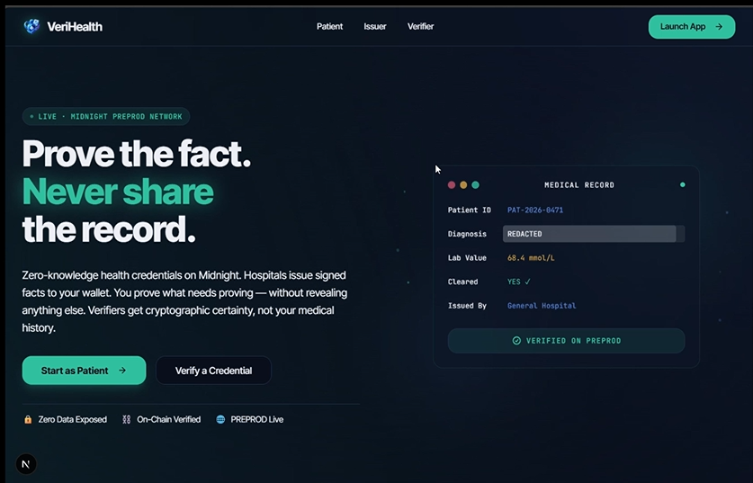

  <p><b>Admin Portal (Registering Issuers)</b></p>
  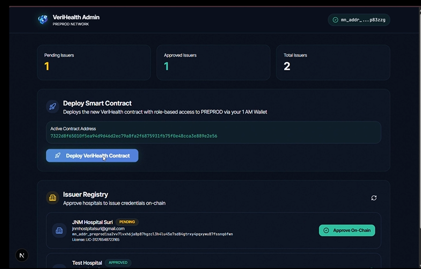

  <p><b>Issuer Portal (Issue Credentials)</b></p>
  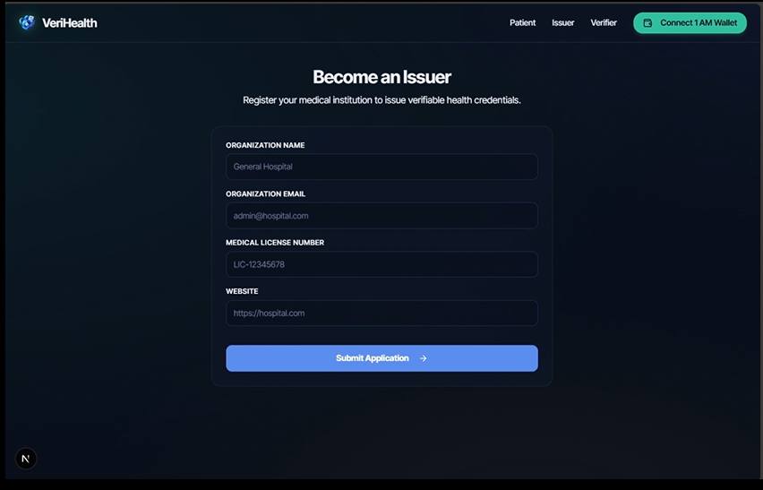
  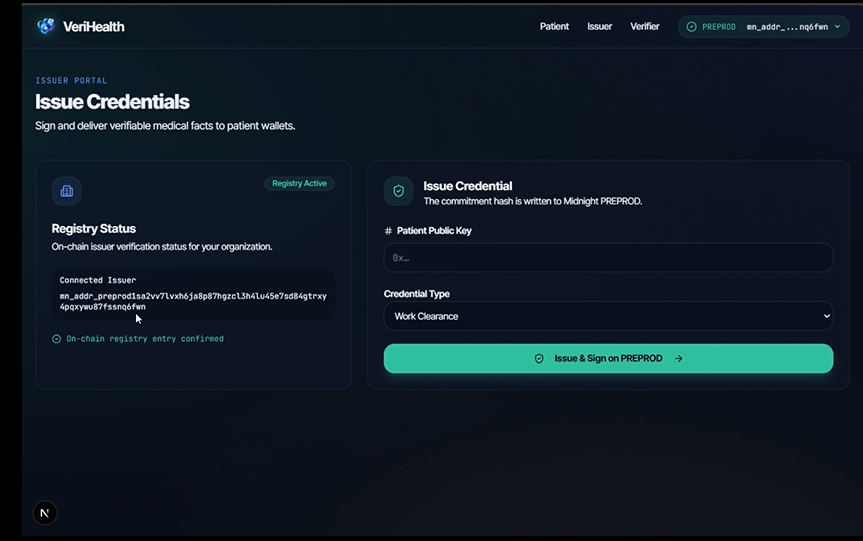

  <p><b>Patient Dashboard</b></p>
  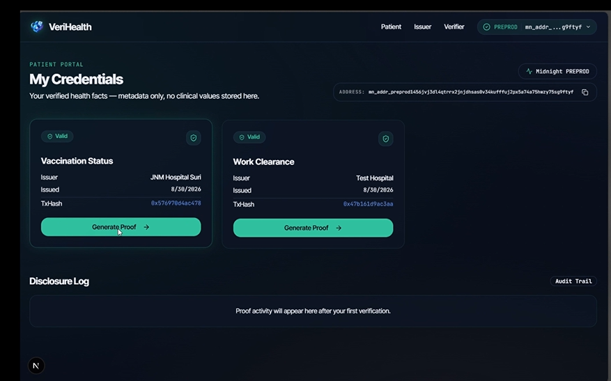

  <p><b>Verifier Portal (Challenge & Results)</b></p>
  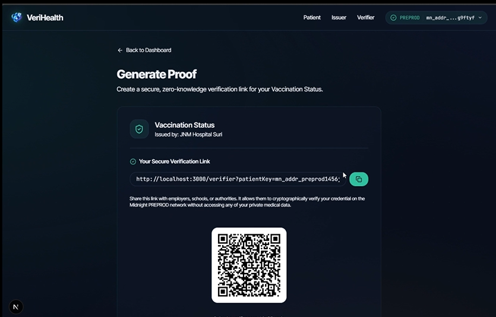
  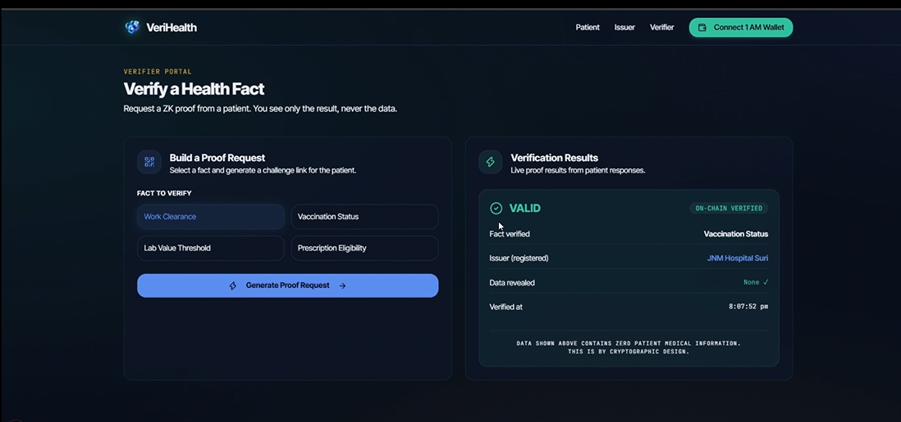
</div>

---

## 🔗 Smart Contracts

VeriHealth smart contracts are written in **Compact** and deployed on **Midnight PREPROD**. The V2 contract (`verihealth-v2.compact`) introduces RBAC, typed credentials, and immutable audit trails.

### On-Chain Proof Links (PREPROD — 1AM Explorer)

| Action | Transaction / Contract | Explorer |
|---|---|---|
| 🚀 **Contract Deployment** | `922b81c891a471f2db2f430312d5db50f4b3bebca8af6ba457cdd4d03443dff3` | [View on Explorer](https://explorer.1am.xyz/contract/922b81c891a471f2db2f430312d5db50f4b3bebca8af6ba457cdd4d03443dff3?network=preprod) |
| 🏥 **Register Issuer Tx** | `54ee78ae3a291f94003edc961354a134a81251d8fccb2e93f1465e0b5422926b` | [View on Explorer](https://explorer.1am.xyz/tx/54ee78ae3a291f94003edc961354a134a81251d8fccb2e93f1465e0b5422926b?network=preprod) |
| 📋 **Issue Credentials Tx** | `eeec5539675012cf46abce1a589faf6edbb0a0bea2d53f97ac4f9047a3485734` | [View on Explorer](https://explorer.1am.xyz/tx/eeec5539675012cf46abce1a589faf6edbb0a0bea2d53f97ac4f9047a3485734?network=preprod) |

<div align="center">
  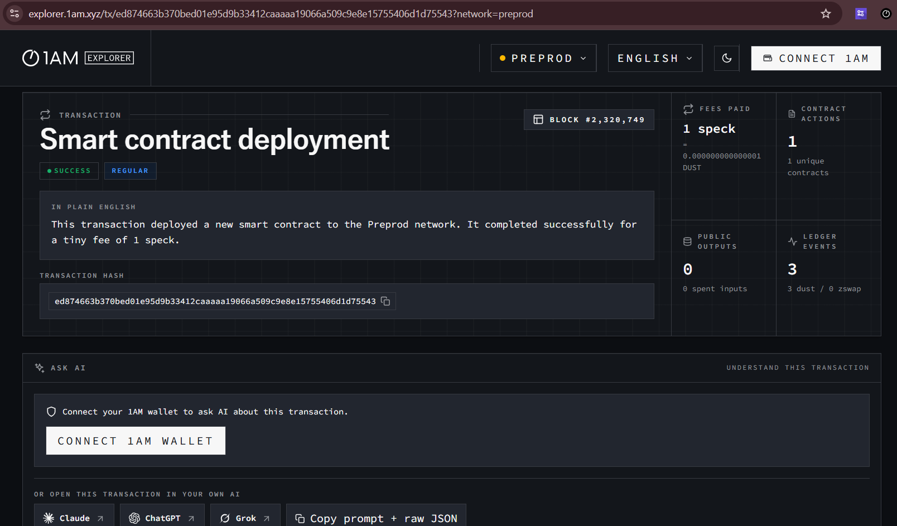
  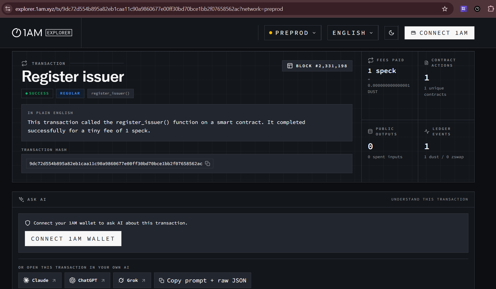
  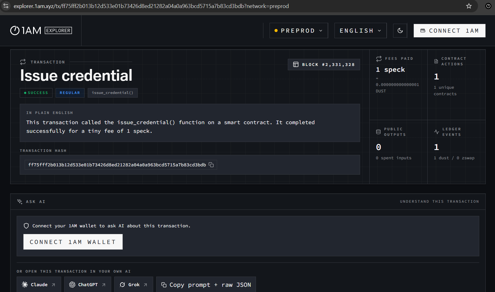
</div>

---

## 🏗️ System Architecture

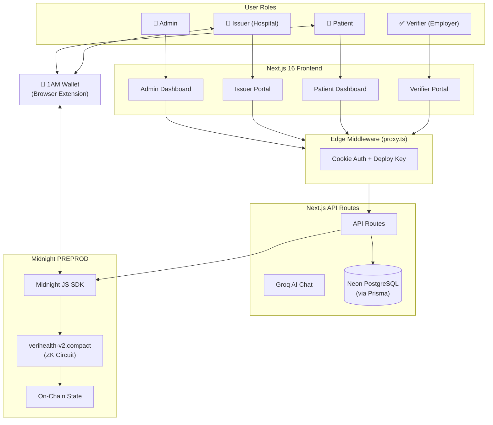
```mermaid
graph TD
    subgraph Users["User Roles"]
        Admin["🔑 Admin"]
        Issuer["🏥 Issuer (Hospital)"]
        Patient["👤 Patient"]
        Verifier["✅ Verifier (Employer)"]
    end

    subgraph Frontend["Next.js 16 Frontend"]
        AdminUI["Admin Dashboard"]
        IssuerUI["Issuer Portal"]
        PatientUI["Patient Dashboard"]
        VerifierUI["Verifier Portal"]
    end

    subgraph Middleware["Edge Middleware (proxy.ts)"]
        Auth["Cookie Auth + Deploy Key"]
    end

    subgraph Backend["Next.js API Routes"]
        API["API Routes"]
        AI["Groq AI Chat"]
        DB[("Neon PostgreSQL\n(via Prisma)")]
    end

    subgraph Midnight["Midnight PREPROD"]
        SDK["Midnight JS SDK"]
        Contract["verihealth-v2.compact\n(ZK Circuit)"]
        Chain["On-Chain State"]
    end

    Wallet["🔐 1AM Wallet\n(Browser Extension)"]

    Admin --> AdminUI
    Issuer --> IssuerUI
    Patient --> PatientUI
    Verifier --> VerifierUI

    AdminUI & IssuerUI & PatientUI & VerifierUI --> Middleware
    Middleware --> API
    API --> DB
    API --> SDK
    SDK --> Contract
    Contract --> Chain

    Patient & Issuer <--> Wallet
    Wallet <--> SDK
```

---

## 📋 User Workflow

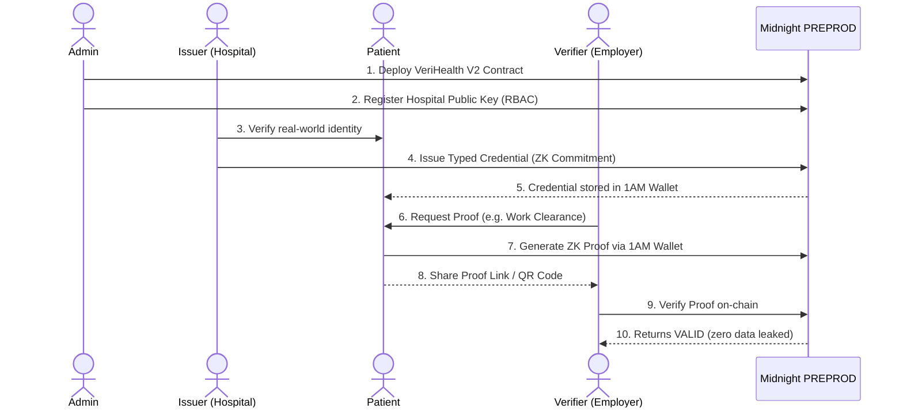
```mermaid
sequenceDiagram
    actor Admin
    actor Hospital as Issuer (Hospital)
    actor Patient
    actor Employer as Verifier (Employer)
    participant Midnight as Midnight PREPROD

    Admin->>Midnight: 1. Deploy VeriHealth V2 Contract
    Admin->>Midnight: 2. Register Hospital Public Key (RBAC)
    Hospital->>Patient: 3. Verify real-world identity
    Hospital->>Midnight: 4. Issue Typed Credential (ZK Commitment)
    Midnight-->>Patient: 5. Credential stored in 1AM Wallet
    Employer->>Patient: 6. Request Proof (e.g. Work Clearance)
    Patient->>Midnight: 7. Generate ZK Proof via 1AM Wallet
    Patient-->>Employer: 8. Share Proof Link / QR Code
    Employer->>Midnight: 9. Verify Proof on-chain
    Midnight-->>Employer: 10. Returns VALID (zero data leaked)
```

---

## 📁 File Structure

```text
VeriHealth/
├── app/                        # Next.js 16 App Router
│   ├── (auth)/                 # Role dashboards
│   │   ├── issuer/             # Issuer Portal
│   │   ├── patient/            # Patient Dashboard
│   │   ├── verifier/           # Verifier Portal
│   │   └── directory/          # Public User Directory
│   ├── admin/                  # Admin Portal (cookie-protected)
│   │   └── login/              # Admin Login Page
│   ├── api/                    # Backend API Routes
│   │   ├── admin/              # Admin CRUD + deploy
│   │   ├── chat/               # Groq AI support bot
│   │   ├── contract/           # On-chain operations
│   │   ├── credentials/        # Credential management
│   │   ├── verifier/           # ZK verification
│   │   └── feedback/           # Feedback submission
│   └── components/             # UI components (chat, onboarding, etc.)
├── contracts/
│   └── src/
│       ├── verihealth.compact  # V1 ZK Circuit
│       └── verihealth-v2.compact # V2 ZK Circuit (RBAC + typed credentials)
├── prisma/
│   ├── schema.prisma           # Database schema
│   └── seed.ts                 # Test data seeder
├── docs/                       # Project documentation
│   ├── ARCHITECTURE.md
│   ├── API.md
│   ├── SETUP.md
│   ├── USERS.md                # 70 verified PREPROD users
│   └── FEEDBACK.md             # 15 user feedback entries
├── __tests__/                  # Jest test suite (50 tests)
├── .github/workflows/          # CI/CD pipelines (5 workflows)
│   ├── ci.yml                  # Master pipeline (all jobs)
│   ├── contracts.yml           # Smart Contract compilation
│   ├── typecheck.yml           # TypeScript type check
│   ├── test.yml                # Jest test suite
│   └── build.yml               # Next.js production build
└── proxy.ts                    # Edge Middleware (auth)
```

---

## 🧪 Testing

VeriHealth uses **Jest** with TypeScript and strict type checks enforced via GitHub Actions CI. **50 tests** across 5 suites pass on every commit.

```bash
npm install
npm run test
```

| Suite | Tests | What is Covered |
|---|---|---|
| `v2-circuit-logic` | 17 | RBAC, ZK issuance, selective disclosure, revocation, immutable audit trail |
| `api/issuer` | 13 | Status shape, registration validation, upsert, field guards |
| `api/verifier` | 9 | Valid/invalid response shape, missing params → 400 |
| `api/credentials` | 5 | Revoke auth, Prisma CRUD logic |
| `ui` | 6 | Button, Badge rendering, disabled state, variants |

<div align="center">
  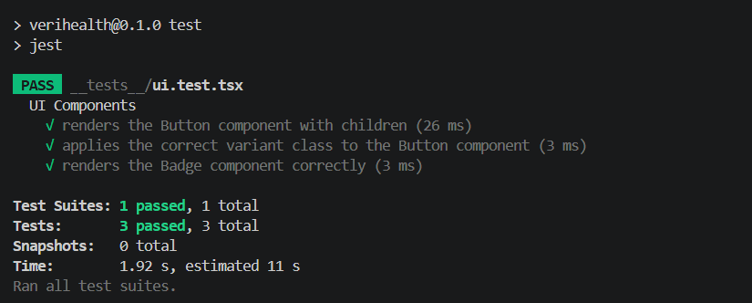
</div>

---

## 🔮 Future Implementation

1. **IoT Medical Devices** — Wearables (glucose monitors, ECG patches) act as direct issuers to a patient's Midnight wallet, enabling insurance proof without raw biometric data
2. **Pharmacy Prescriptions** — Doctor issues a prescription credential; patient proves valid script to pharmacy without revealing diagnosis history
3. **Automated Insurance Underwriting** — ZK proofs submitted to smart-contract-based insurance policies, eliminating manual claims review and data leaks
4. **QR / PDF Proof Export** — Download proof as a verifiable PDF or offline QR code for use without internet connectivity *(Planned — user request FB-009)*
5. **Multilingual Support** — Hindi and regional language UI for wider accessibility *(Planned — user request FB-014)*

---

## 🙏 Acknowledgements

A massive **Thank You** to the Midnight Team for organizing this incredible buildation, providing phenomenal documentation, and building a blockchain that genuinely prioritizes data protection and privacy! 🎉
