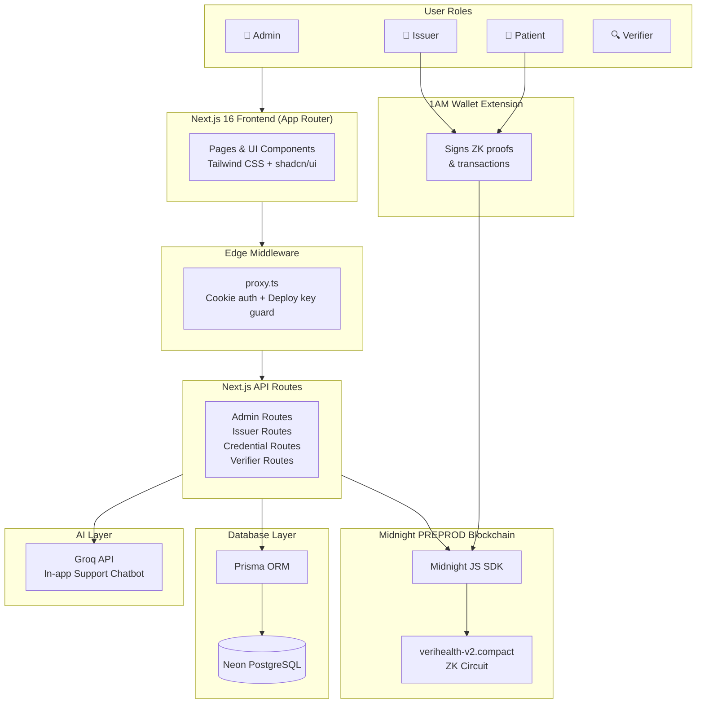
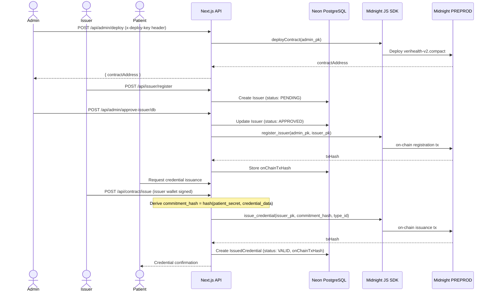
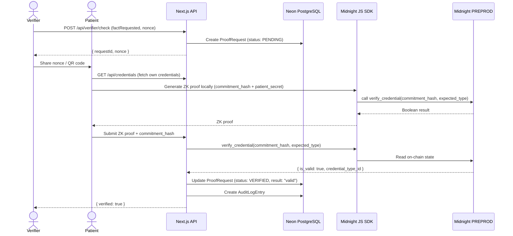
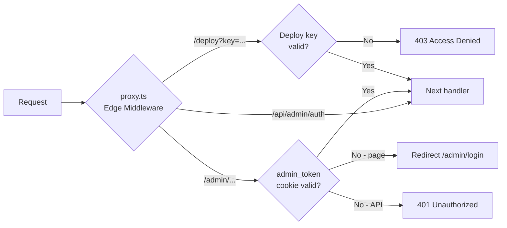

# VeriHealth — Technical Architecture

## 1. System Overview

VeriHealth is a Zero-Knowledge health credential platform built on the Midnight PREPROD blockchain. It enables healthcare organisations (issuers) to issue tamper-proof, privacy-preserving digital credentials to patients, and allows third-party verifiers to confirm the validity of those credentials without ever seeing the underlying private health data. The system combines a Next.js 16 full-stack web application, a Compact ZK circuit (`verihealth-v2.compact`) deployed on Midnight PREPROD, a Neon PostgreSQL database managed through Prisma ORM for off-chain state, and the 1AM Wallet browser extension for patient and issuer signing.

---

## 2. High-Level Architecture



---

## 3. Layer Breakdown

| Layer | Technology | Purpose |
|---|---|---|
| **Frontend** | Next.js 16 + Tailwind CSS + shadcn/ui | Role-specific UIs for Admin, Issuer, Patient, and Verifier |
| **API** | Next.js API Routes (App Router) | Backend logic, contract interaction, credential lifecycle management |
| **Auth** | Edge Middleware (`proxy.ts`) | Cookie-based admin auth + `DEPLOY_SECRET` key protection for deployment |
| **Database** | Prisma ORM + Neon PostgreSQL | Off-chain credential state, issuer registry, audit logs, verifier management |
| **ZK Circuit** | Compact (`verihealth-v2.compact`) | Zero-Knowledge proof logic for issuing, verifying, and revoking credentials |
| **Blockchain** | Midnight PREPROD | On-chain credential commitments and immutable audit trail |
| **Wallet** | 1AM Wallet Browser Extension | Patient and issuer signing of ZK proofs and blockchain transactions |
| **AI Support** | Groq API (`openai/gpt-oss-20b`) | In-app support chatbot for user guidance |

---

## 4. Smart Contract Architecture

The ZK circuit is defined in [`contracts/src/verihealth-v2.compact`](../contracts/src/verihealth-v2.compact) and compiled to Midnight PREPROD.

### Constructor

```compact
constructor(admin_pk: Bytes<32>) {
    owner = disclose(admin_pk);
}
```

The `admin_pk` argument is **disclosed** (made public on-chain) and stored as `owner`. This sets the admin public key at deploy time and cannot be changed.

### Ledger State

| State Variable | Type | Description |
|---|---|---|
| `owner` | `Bytes<32>` | Public key of the deploying admin |
| `approved_issuers` | `Map<Bytes<32>, Boolean>` | Registry of admin-approved issuer public keys |
| `issued_credentials` | `Map<Bytes<32>, CredentialState>` | Credential commitments keyed by `commitment_hash` |

The `CredentialState` struct holds:

```compact
struct CredentialState {
    is_valid: Boolean;
    issuer_pk: Bytes<32>;
    credential_type_id: Uint<32>;
}
```

### Circuits

| Circuit | Access | Description |
|---|---|---|
| `register_issuer(caller_pk, new_issuer_pk)` | Admin only | Asserts `caller_pk == owner`; inserts `new_issuer_pk` into `approved_issuers` |
| `issue_credential(caller_pk, commitment_hash, type_id)` | Approved issuers only | Asserts caller is in `approved_issuers`; stores a `CredentialState` commitment on-chain |
| `verify_credential(commitment_hash, expected_type)` | Public | Returns `true` if the commitment exists, is valid, and matches the requested `type_id` |
| `revoke_credential(caller_pk, commitment_hash)` | Original issuer only | Sets `is_valid = false` without deleting the record, preserving an immutable audit trail |

### Privacy Model

| Data | Visibility |
|---|---|
| `owner` public key | **Public** — disclosed at construction |
| Issuer public keys in `approved_issuers` | **Public** — disclosed via `disclose()` |
| `commitment_hash` (on-chain key) | **Public** — disclosed; derived off-chain as `hash(patient_secret, credential_data)` |
| Raw patient health data | **Never on-chain** — only the commitment hash is stored |
| Credential `type_id` | **Public** — disclosed on issuance |
| `is_valid` status | **Public** — disclosed on issuance and revocation |

The ZK proof guarantees that the patient *knows* the pre-image of the commitment hash without revealing their private health data to the verifier.

---

## 5. Data Flow Diagrams

### 5a. Credential Issuance Flow



### 5b. Verification Flow



---

## 6. Database Schema Overview

Managed by Prisma ORM against a Neon PostgreSQL instance. See [`prisma/schema.prisma`](../prisma/schema.prisma) for the full source.

| Model | Key Fields | Purpose |
|---|---|---|
| `Issuer` | `id`, `orgName`, `orgEmail`, `publicKeyHex` (unique), `registryStatus` (`PENDING`/`APPROVED`/`REVOKED`), `onChainTxHash` | Off-chain issuer registry; status mirrors on-chain `approved_issuers` map |
| `CredentialType` | `id`, `typeId` (auto-increment, mirrors on-chain `Uint<32>`), `name`, `description` | Catalogue of credential types; `typeId` is the integer used in the ZK circuit |
| `IssuedCredential` | `id`, `patientPublicKey`, `status` (`VALID`/`EXPIRING`/`REVOKED`), `issueDate`, `expiryDate`, `onChainTxHash`, `onChainTypeId`, `revokedAt`, `issuerId` (FK), `credentialTypeId` (FK) | Off-chain mirror of on-chain `issued_credentials` map |
| `Verifier` | `id`, `orgName`, `apiKeyHash` (unique), `billingTier` (`FREE`/`PAY_PER_USE`/`SUBSCRIPTION`) | Third-party verifier accounts |
| `ProofRequest` | `id`, `nonce` (unique), `factRequested`, `status` (`PENDING`/`VERIFIED`/`FAILED`/`EXPIRED`), `result`, `verifierId` (FK), `expiresAt` | Tracks verification sessions |
| `AuditLogEntry` | `id`, `actorType`, `actionType`, `credentialTypeId`, `verifierId`, `result`, `timestamp` | Append-only audit trail for compliance |
| `RegistryCache` | `id`, `issuerPublicKey` (unique), `isActive`, `lastSyncedAt`, `onChainTxHash` | Local cache of on-chain issuer registry for fast lookups |
| `FeedbackEntry` | `id`, `rating`, `category`, `message`, `userAgent`, `createdAt` | User-submitted product feedback |

---

## 7. Authentication Architecture

VeriHealth uses a two-layer authentication model implemented entirely in [`proxy.ts`](../proxy.ts) as a Next.js Edge Middleware.

### Layer 1 — Admin Portal (Cookie-based)

The middleware matches `/admin`, `/admin/:path*`, and `/api/admin/:path*`. For every request to those paths (except `/api/admin/auth`), it reads the `admin_token` HttpOnly cookie and decodes it with `atob`. The decoded value must contain the `ADMIN_SECRET` environment variable as the second `:` -delimited segment. On failure, page requests are redirected to `/admin/login` and API requests receive `401 Unauthorized`.

```
Cookie: admin_token = base64(timestamp:ADMIN_SECRET)
```

### Layer 2 — Deploy Endpoint (Secret Header)

The `/api/admin/deploy` route additionally validates the `x-deploy-key` request header against the `DEPLOY_SECRET` environment variable server-side (in [`app/api/admin/deploy/route.ts`](../app/api/admin/deploy/route.ts)). The deploy page (`/deploy`) is separately guarded by the middleware via the `?key=<DEPLOY_SECRET>` query parameter.

```
Header: x-deploy-key: <DEPLOY_SECRET>
```

> [!IMPORTANT]
> The deploy endpoint uses a **dynamic import** to load the Midnight JS SDK at request time, keeping the heavy SDK (which uses Node.js-only modules like `ws` and `leveldb`) out of the client bundle entirely.

### Auth Flow Summary



---

## 8. CI/CD Pipeline

The project uses GitHub Actions for continuous integration. Workflows run on every push and pull request to `main`.

| Workflow | Trigger | Steps |
|---|---|---|
| **Typecheck** | Push / PR | `tsc --noEmit` across the Next.js app |
| **Tests** | Push / PR | `npm run test` — API and integration tests |
| **Build** | Push / PR | `npm run build` — verifies production build succeeds |
| **Smart Contracts** | Push / PR (on `contracts/**`) | Installs Compact compiler (pinned version), runs `compact compile`, then `npm test` against the local undeployed network |

> [!NOTE]
> The `COMPACT_VERSION` used in CI must match the version pinned in your local WSL environment. If the two diverge, contract compilation will succeed locally but fail in CI. Always record the version in your `SETUP.md` version table after installing.
